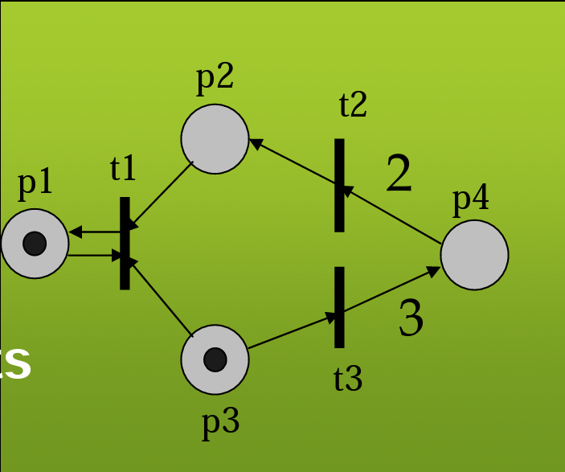
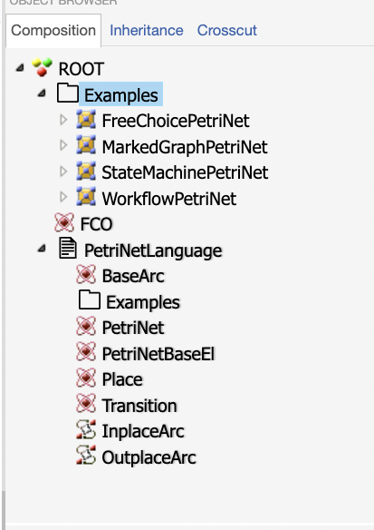
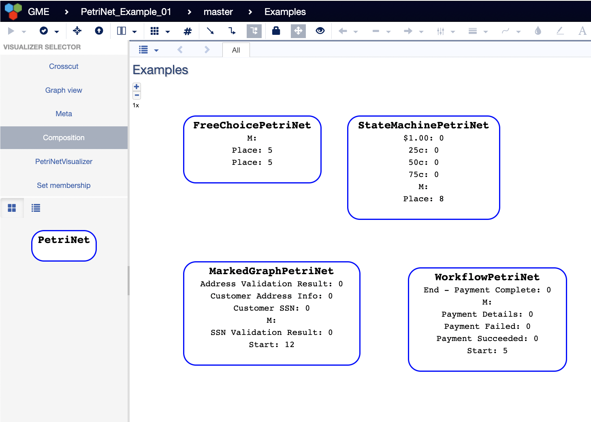
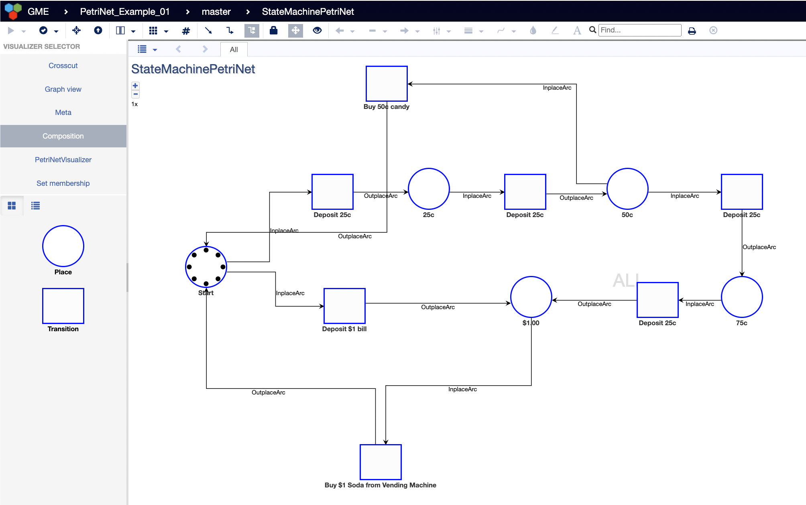

# PetriNet Networks

## Introduction to PetriNets and Domain Overview
A PetriNet is a particular kind of directed graph, with an initial state called a marking. 
The PetriNet graph has two kinds of vertices:
- Places 
- Transitions.
 
Places are drawn as circles, and transitions are drawn as bars or rectangular boxes.
Directed arcs may exist only between different types of vertices. (Such a graph is called a bipartite
graph).

PetriNet Model was introduced by `Carl Adam Petri` around 1962 (https://en.wikipedia.org/wiki/Carl_Adam_Petri)

PetriNets can be applied many areas including but not limited to:
1. Distributed Computing
2. Manufacturing
3. Network Communications
4. Transportation etc..

Here is an exmple PetriNet:

 
1. The Places (Circles) represent distributed state by holding tokens.
   1. with marking (sate) M as a n-vector (m1, m2, m3..) where mi is the non-negative number of tokens in place pi
   2. inital marking (M0) is the inital state.
2. The Transitions represents actions/events 
   1. A Transition is enabled if there are enough tokens in each input place it is connected with 
   2. An enabled transition may or may not fire 
   3. The firing of a transition modifies marking by consuming tokens from each of the input places and producing tokens in each of the output places

### Some Subclasses of PetriNets
#### Marked Graphs
Every place has at most 1 predecessor and 1 successor transition
Models only causality and concurrency (no conflict)

#### State Machines
Every transition has at most 1 predecessor and 1 successor place
Models only causality and conflict– (no concurrency, no synchronizatio of parallel activities)

#### Free-Choice Petri Nets
Every transition after a choice has exactly 1 predecessor place
The outcome of a choice depends on the value of the token rather than on its arrival time.

### Petri Net Extenstions
Add interpretation to tokens and transitions
   - Colored nets (tokens have value)
   
Add time
   - Time/timed Petri Nets
   - Stochastic PNs
   - Generalized Stochastic PNs

Add hierarchy
- Place Charts Nets
   

## Installation
First, install the PetriNetJoint following:
- [NodeJS](https://nodejs.org/en/) (LTS recommended)
- [MongoDB](https://www.mongodb.com/)

Second, start mongodb locally by running the `mongod` executable in your mongodb installation (you may need to create a `data` directory or set `--dbpath`).

Then, run `webgme start` from the project root to start. 

Finally, navigate to `http://localhost:8888` to start using PetriNetJoint

### How to model using the design studio
Create a new Project with any appropriate name and choose the "PetriNet" as the base for it.

The new project will be pre-populated with the PetriNetLanguage (Model) and with Examples.

The Composition view on the right side will look like below:

Now one can create a new PetriNework by going into the Composition view of Examples folder and then dragging and dropping the "PetriNet" component from the Part Browser (rightside)
Then give a new name to the new PetriNet you are planning to develop and then enter its composition view 

Here is how the Composition view of Examples folder looks like:

In the composition view of the newly created PetiNet, one will have access to Places and Transitions from the Part Browser (on the right side)
Drag and Drop the Places and Transitions as requried and start buliding a new Network!

The ars that stem from a Place and end in Transition are caleed InplaceArc

The arcs that stem from a Transition and end in Place are called OutplaceArc

Arcs can be drawn between Places and Transitions by  clicking an dragging the mouse from one component to the other.

The `tokens` attribute of the Places can be edited and given some initial number of tokens
For example in the below PetriNet the Initial sate of Start Place has 8 tokens
A sample Prepared Petrinet would looke like below:

One can create many Networks and can be put under the Examples folders.
If required the Name of the Folder can be updated as desired
Or more examples folder can be created and dragging and dropping the `Examples` folder from the PetriNetLanguage's composition view

### Features provided by this version of the Design Studio:
This version of the studio provides the following features:
1. It provides users an ability to set the number of initial tokens for each places.
2. The PetriNetVisualizer view provides an ability for users to
   1. View the inital state of their network
   2. Simulate the flow by stepping through the transitions in the network
   3. If a transition is enabled then it will be show with green color
   4. If a transition is not enabled then it will be shown with red color
   5. Users can click the enabled (green color) transition boxes and watch the flow of the tokens from place to place
   6. It provides an ability to reset the network visualization to the initial state.
   7. And user can repeat this as many times as desired.
   8. If a newtork ends in a dead lock, then all of the transitions would be shown in red color, then user would reset it to its initial state.
    

References:
https://ptolemy.berkeley.edu/projects/embedded/research/hsc/class/ee249/lectures/l7-PetriNets.pdf

